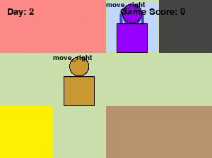
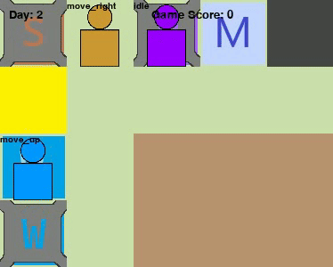
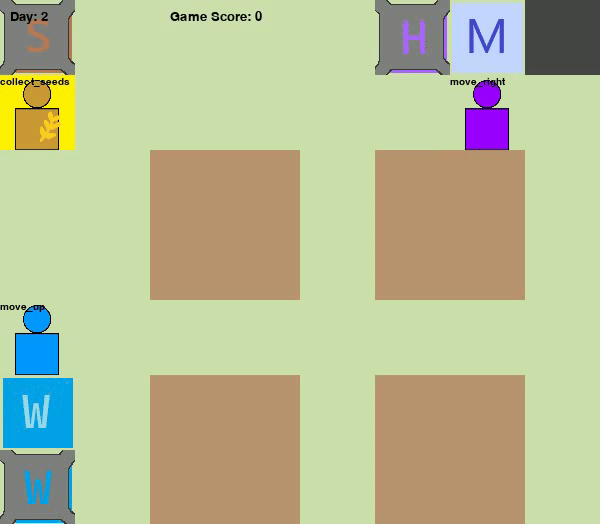
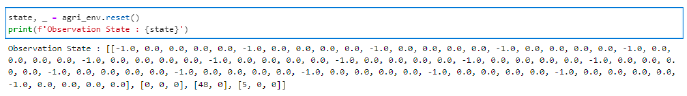
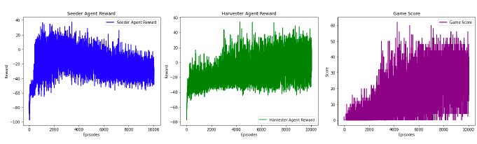
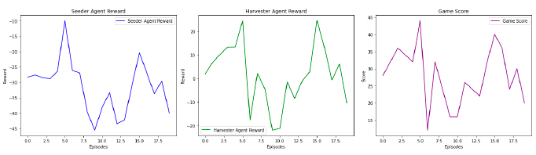
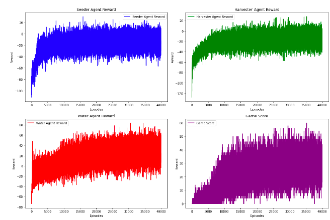
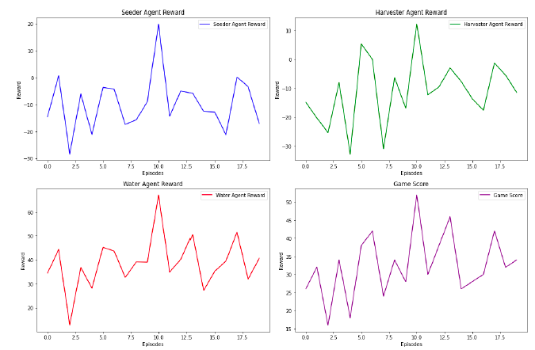
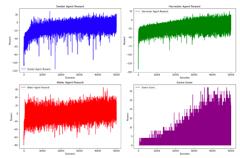
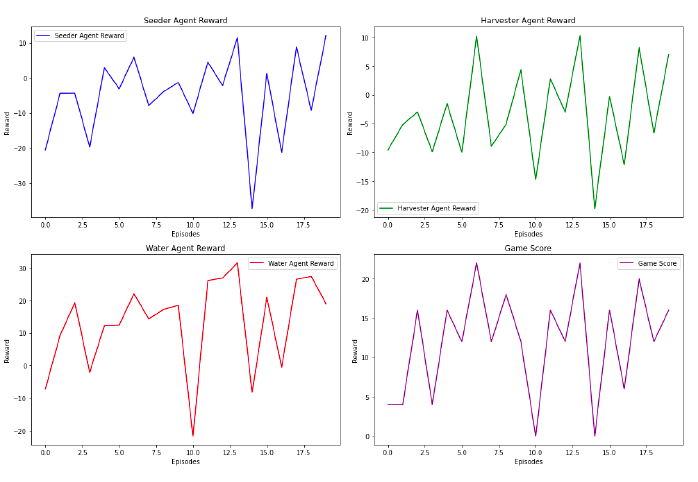

# Multi-Agent Autonomous Agriculture

### Introduction

This project explores how multi-agent robots can collaborate to optimize farming tasks like planting, watering and harvesting. It aims to improve coordination and resource management in autonomous agriculture, boosting crop yield while reducing labor costs and resource waste. The focus is on training specialized agents to work together efficiently, ensuring every section of the farm receives proper care at the right time by creating custom RL environment.

## Evaluation Videos

### 4x3 Grid with 2 Agents

### 5x4 Grid with 3 Agents

### 8x7 Grid with 3 Agents

#### Legend 
- Red T/ 'S' Tile : Starting position of the agents
- Yellow Tile: Seeding station to pickup seeds
- 'W' Tile: Water station to pickup water
- 'M' Tile: Station to dropoff picked up seeds 
- Black Tile: Garbage/ Discard station

#### Agents
- Brown Colored Agent: Seeder Agent responsible for planting seeds onto plots
- Blue Colored Agent: Water Agent responsible for watering seeded plots
- Puple colored Agent: Harvester Agent responsible for harvesting plants once they grow / Discard rotten or spoilt crops.

# Implementation

## Observation Space
The observation space of the environment involves combining the plot states and the agents’ states. The observation space is an array of arrays. `[[number of plots x plot states], [seeder agent state], [water agent state], [harvester state])`.

## Plot state

Plot state is given as `[crop_state,crop_type, water_status, growth_percentage, yield_value]`

Plot State: `[0, 0, 0, 0.0, 0.0 ]` indicates:
- `0`: Crop not planted
- `0`: Plot is Empty
- `0`: Plot not watered
- `0.0`: Growth percentage
- `0.0`: Yield value of the crop at current stage

## Agent states

### Seeder Agent
The agent’s state is represented by `[position, number_of_seeds_holding, seed_type]`,
- `Position` : current position of the seeding agent (0-55 as there are 56 cells)
- `number_of_seeds_holding` : number of seeds being carried by the agent.
- `seed_type` : seed type (0 = Empty, 1 = Wheat, 2 = RICE, 3 = CORN) currently held by the agent

### Water Agent
The agent’s state is represented by `[position, number_of_water_units]`,
- `Position` : position of the agent in the grid and number of water units currently the agent is holding
- `number_of_water_units` : number of water units currently the agent is holding

### Harvester Agent
The agent’s state is represented by `[position, seed_type, yield_value]`,
- `Position` : current position of the seeding agent (0-55 as there are 56 cells)
- `number_of_seeds_holding` : type of crop the agent is carrying (0 = Empty, 1 = Wheat, 2 = RICE, 3 = CORN)
- `yield_value` : yield value of the crop.

# Reward Functions

We defined separate reward functions for each agent according to their respective actions.

---

### Seeder Agent

#### 1. Movement Actions
- Small penalty of **-0.01**.
- Penalty of **0.2** if:
  - Movement is blocked by an obstacle or out of bounds.
  - Agent moves into unrelated grid cells (market, garbage, water agent station, harvester agent station).

#### 2. Idle
- Positive reward of **+0.2** if the agent has planted all plots and idles at its station.
- Penalty of **-0.2** if idling at the station with empty plots remaining.

#### 3. Picking Up Seeds
- Reward of **+0.5** for picking up seeds from seed stations.
- Penalty of **-0.2** for:
  - Attempting to pick up from wrong locations.
  - Picking up seeds with full capacity.

#### 4. Planting Seeds
- Reward of **+1** for planting seeds in an empty plot.
- Penalty of **-0.2** for planting seeds in a non-plot location.

#### 5. Dropping Seeds
- Penalty of **-0.2** for:
  - Dropping seeds without planting at least one plot.
  - Dropping seeds at locations other than seed stations.
- Reward of **+0.2** for dropping seeds after planting at least one plot.

---

### Water Agent

#### 1. Movement Actions
- Small penalty of **-0.01**.
- Penalty of **0.2** if:
  - Movement is blocked by an obstacle or out of bounds.
  - Agent moves into unrelated grid cells (market, garbage, seeder agent station, harvester agent station).

#### 2. Idle
- Positive reward of **+0.2** if the agent has watered all required plots and idles at its station.
- Penalty of **-0.2** if idling at the station despite pending plots to be watered.

#### 3. Collecting Water
- Reward of **+0.5** for collecting water from water tanks.
- Penalty of **-0.2** for:
  - Attempting to collect water from wrong locations.
  - Collecting water with full capacity.

#### 4. Watering Crops
- Reward of **+1** for successfully watering a plot.
- Additional joint reward of **+0.5** for the seeder agent to promote cooperation.
- Penalty of **-0.2** for watering non-plot grids or empty plots.

---

### Harvester Agent

#### 1. Movement Actions
- Small penalty of **-0.01**.
- Penalty of **0.2** if:
  - Movement is blocked by an obstacle or out of bounds.
  - Agent moves into unrelated grid cells (market, garbage, seeder agent station, water agent station).

#### 2. Idle
- Positive reward of **+0.2** if the agent has harvested all required plots and idles at its station.
- Penalty of **-0.2** if idling at the station despite pending plots to be harvested.

#### 3. Harvesting Crops
- Reward of **+1** for harvesting a plot.
- Additional joint reward of **+0.5** for both the seeder agent and the harvester agent.
- Penalty of **-0.2** for attempting to harvest in wrong locations.

#### 4. Dropping Crops
- **At the Market**:
  - Joint reward split between harvester and seeder agents.
  - Global reward = Yield value × Market value.
  - Example: If crop is valued at 4, **+4** reward to harvester and **+2** reward to both seeder and water agents.
- **At the Garbage**:
  - Small reward of **+0.2** to harvester for clearing the plot.

# Implementation

## 4x3 Grid with 2 Agents
- **Setup**:  
  - Environment with two agents: Seeder and Harvester.
  - Grid Size: Not specified (smaller).
  - Agents trained with single-thread Actor-Critic networks over **10,000 episodes**.
  - Experience replay buffer used for sampling experiences.
  - Optimization included policy loss, critic loss, and entropy regularization.

- **Training Observations**:  
  - Rewards increased steadily but with a lot of instability.
  - Game score improved from **0** to a maximum of **60**.

  

- **Evaluation**:  
  - Average reward: **28** over 20 test episodes.
  - Highest reward: **44**.
  - Agents successfully cooperated and completed harvesting tasks effectively.
  - Coordination was easier with only two agents.

  

## 5x4 Grid with 3 Agents

- **Setup**:  
  - Added a new agent: **Water Agent**.
  - Grid Size: **4x5** (increased complexity).
  - Number of plots: **6**.
  - Plots must be watered after seeding for crop growth.
  - A separate Actor-Critic network introduced for the water agent.
  - Trained for **40,000 episodes**.

- **Training Observations**:  
  - Seeder agent’s reward increased steadily early on, stabilizing later with some fluctuations due to agent interactions.
  - Overall game score steadily increased.
  
  

- **Evaluation**:  
  - Average game score: **32.5** over 20 episodes.
  - Highest score: **52**, Lowest score: **16**.
  - Agents coordinated well despite additional complexity.

  

## 8x7 Grid with 3 Agents

- **Setup**:  
  - Further scaled environment with the same three agents.
  - Grid Size: **8x7**.
  - Number of plots: **16**.
  - Trained for **90,000 episodes**.
  - Learning rate: **0.0005**, Gamma: **0.90**.

- **Training Observations**:  
  - Rewards increased and slowly started stabilizing after **40,000 episodes**.
  - Game score stabilized around **30**, but with large variations due to agent interaction unpredictability.

  
  
- **Evaluation**:  
  - Average reward: **12** over 20 episodes.
  - Highest game score: **22**.
  - Agents could harvest crops 5–6 times on average, despite high complexity.
  - Variations attributed to agents' lack of awareness of other agents' positions, leading to environment uncertainty.

  

## References

## References

1. [PettingZoo - Multi-agent RL environments](https://github.com/Farama-Foundation/PettingZoo)
2. [Gymnasium - Modernized OpenAI Gym](https://gymnasium.farama.org/index.html)
3. [Pygame - Python Game Development](https://www.pygame.org/docs/)
4. [Tqdm - Progress Bars for Python](https://tqdm.github.io/)
5. [New Environments and Algorithms for Multi-agent RL](https://agents.inf.ed.ac.uk/blog/new-environments-algorithm-multiagent-rl/)
6. [Robotic Warehouse Simulation](https://github.com/semitable/robotic-warehouse)
7. [PyTorch Deep Reinforcement Learning Examples](https://github.com/ChenglongChen/pytorch-DRL)
8. [OpenAI Multiagent Particle Envs](https://github.com/openai/multiagent-particle-envs)
9. [A Deep Reinforcement Learning-based Multi-agent Area Coverage Control for Smart Agriculture - ScienceDirect](https://www.sciencedirect.com/science/article/abs/pii/S2468013320300392)
